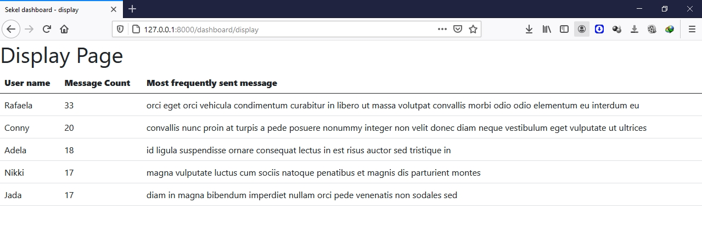

# Sekel Technologies assignment

A __Django web application__ which takes data from [http://www.mocky.io/v2/5d403d913300003a209d2ad3](http://www.mocky.io/v2/5d403d913300003a209d2ad3)
and displays the top 5 users with their names, message count and latest message


The response has the string where it contains data in the following format:
“Username:message , Username:message , Username:message …. ”

Here, calculating the top five users who've sent maximum number of messages. 

Logic:
1) calculating the count of messages with respect to user and storing in 
name_messageCount map, meanwhile finding the latest message for a user
and storing in name_latestMessage map.
2) Here, we need top 5 users. So, implementing a min-heap of (messageCount, name) will address this issue, whenever if we found messageCount > minimum_messageCount in 
minHeap then we need to replace. Likewise, we get the top 5 users with max messages.
3) Storing the name, messageCount, latestMessage in a dictionary in 
```
{"name": "XYZ", "messageCount":564, "latestMessage":"How you are doing?"} 
```
format.
4) Printing these users in a table in HTML format

Here's the following output:



## Steps to see the required output:

1) Clone the repository
```
git clone https://github.com/FazeelUsmani/Sekel-Technologies-Backend-Assignment.git
```

2) Open SEKEL_ASSN/sekel folder which contains manage.py file and enter the following command
```
python manage.py runserver
```

The app should now be up and running at [http://localhost:8000/dashboard/display](http://localhost:8000/dashboard/display) 🚀
